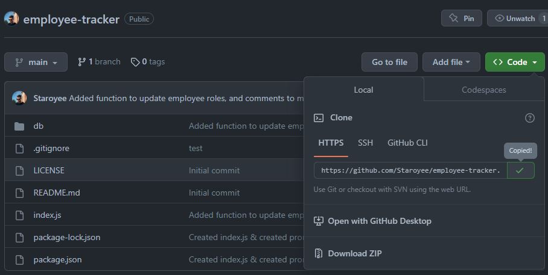

# employee-tracker

## Description
I was tasked to create a command line application used to access/view a database, update and add to the database.

I was motivated to undertake this task because I wished to gain a greater understanding of mysql databases and data manipulation statements.

## Solve
The completion of this project provides the user with a functional CLI application to access, view, add to, and update a database.

## I have learned:
* How to use data manipulation statements to manipulate data within sql databases.
* How to use object oriented programming, and imporing/exporting modules.
* MySQL.

## Installation
Steps to install this project on your local PC
1. Open the termal on your machine.
2. Use the terminal command `cd` to navigate to the directory where we want the repository located.
3. Locate the 'Code' button on the 'employee-tracker' github repository, click it, then copy the 'HTTPS' link to clipboard. (See image)

4. Use the git command `git clone` followed by the URL copied from Github to clone the repo to our machine.
5. The `git clone` command creates a new directory with the same name as the repository. We navigate into our new directory using `cd`.
6. The repository should now be cloned onto your device and able to be edited in VScode or another editing software.
7. Install the NPM dependencies by opening the terminal in the index.js file and running the command 'npm i'.
8. Install MySQL and run the Schema.sql and Seeds.sql files in the CLI to add the databases to your system.

## Video Link
https://drive.google.com/file/d/1MJgmL2Y8VzSn7bLRMjgYKaL_tD1n3n9F/view?usp=sharing

## Instructions

To use the app:
1. Open the index.js file in the CLI
2. Run 'node index.js' in the CLI
3. Use the arrow keys and enter to navigate
4. Enter details as required

## Credits
* Received tutor assistance.
* Week 12 activities.
* https://developer.mozilla.org/en-US/docs/Web/JavaScript/Reference/Classes
* https://dev.mysql.com/doc/refman/8.0/en/set-operations.html
* https://dev.mysql.com/doc/refman/8.0/en/sql-data-manipulation-statements.html